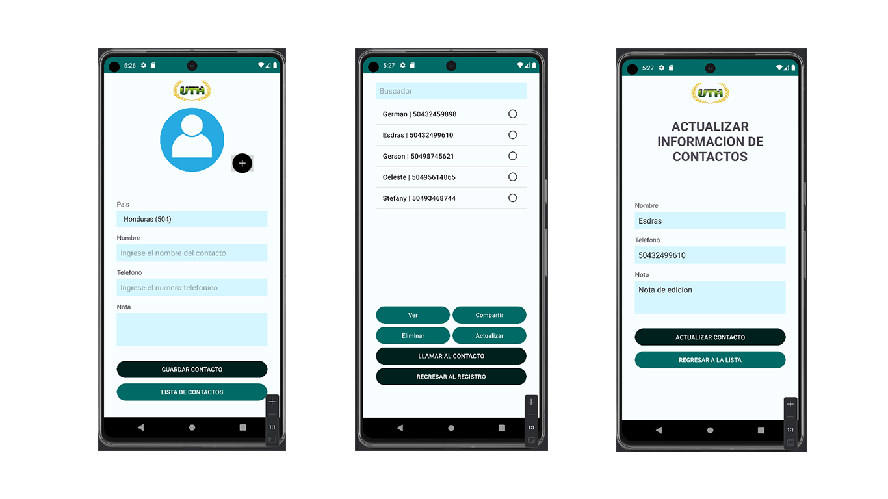

# ContactApp (UTH)

ContactApp es una aplicación móvil diseñada para simplificar la gestión de contactos en tu dispositivo. Con esta aplicación, puedes crear, visualizar, editar y eliminar fácilmente tus contactos, todo desde una interfaz intuitiva y amigable. Además de almacenar información básica de contacto, como nombre y número de teléfono, ContactApp te permite adjuntar una foto y notas personales a cada contacto para una mejor organización.

## Características Principales

- **Registro de Contactos:** Permite agregar nuevos contactos con su nombre, número de teléfono, foto y notas adicionales.
- **Visualización y Edición:** Accede rápidamente a tus contactos existentes para ver o actualizar su información en cualquier momento.
- **Eliminación de Contactos:** Elimina contactos que ya no necesites de forma sencilla.
- **Compartir Contactos:** Comparte la información de tus contactos con otros a través de diversas plataformas de comunicación.
- **Llamada Directa:** Realiza llamadas directamente desde la aplicación con solo tocar un botón, sin tener que buscar el número en tu dispositivo.

## Desarrolladores

Este proyecto ha sido desarrollado por:

- **Esdras Abiel Clother Paz 			202010010048**
- **Jafeth Donatilo Rápalo Rivera  202120030040**
- **Bayardo Antonio Ponce Ruiz    202110110125**

## Instrucciones de Uso

1. Abre la aplicación ContactApp en tu dispositivo móvil.
2. Para agregar un nuevo contacto, selecciona la opción "Agregar Contacto" y completa los campos requeridos, incluyendo nombre, número de teléfono y, opcionalmente, una foto y notas.
3. Para ver o editar un contacto existente, simplemente busca el contacto en la lista y selecciona su entrada.
4. Si necesitas eliminar un contacto, selecciona el contacto y da click en el boton de "Eliminar".
5. Para compartir un contacto, abre el perfil del contacto y selecciona la opción de compartir.
6. Para realizar una llamada a un contacto, simplemente selecciona su número de teléfono desde su perfil.

¡Disfruta de una gestión de contactos más simple y eficiente con ContactApp!
